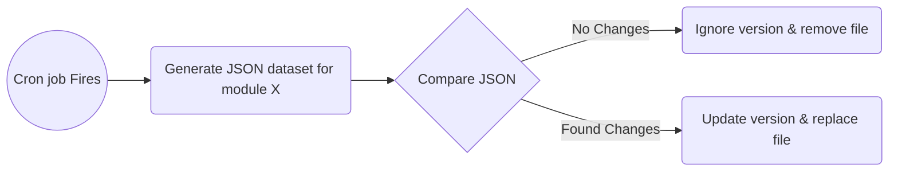

# Data Gathering
The current list aims to define & produce the datasets that are characterised as "static" in the context of the Frontend API library.

Periodic version checking will help the app to be up-to-date, whereas the user can also trigger a version check through settings.

## Modules

### Courses
	[
	  {
	    "type": "undergraduate_courses",
	    "url": {
	      "en": "https://www.csd.uoc.gr/index.jsp?content=courses_catalog&lang=en",
	      "gr": "https://www.csd.uoc.gr/index.jsp?content=courses_catalog&lang=gr"
	    },
	    "table_regex": ""
	    "mapper": {}
	  },
	  {
	    "type": "postgraduate_courses",
	    "url": {
	      "en": "https://www.csd.uoc.gr/CSD/index.jsp?content=pg_courses_catalog&lang=en",
	      "gr": "https://www.csd.uoc.gr/CSD/index.jsp?content=pg_courses_catalog&lang=gr"
	    },
	    "table_regex": ""
	    "mapper": {}
	  }
	]

### Model Program
	[
	  {
	    "type": "model_program",
	    "url": {
	      "en": "https://www.csd.uoc.gr/index.jsp?content=model_program&lang=en",
	      "gr": "https://www.csd.uoc.gr/index.jsp?content=model_program&lang=gr"
	    },
	    "table_regex": ""
	    "mapper": {}
	  }
	]
### Schedule
	[
	  {
	    "type": "time_schedule",
	    "url": {
	      "en": "https://www.csd.uoc.gr/CSD/index.jsp?content=time_schedule&lang=en",
	      "gr": "https://www.csd.uoc.gr/CSD/index.jsp?content=time_schedule&lang=gr"
	    },
	    "table_regex": ""
	    "mapper": {}
	  }
	]
### People
	[
	  {
	    "type": "academic_staff",
	    "url": {
	      "en": "https://www.csd.uoc.gr/index.jsp?content=academic_staff=&lang=en",
	      "gr": "https://www.csd.uoc.gr/index.jsp?content=academic_staff=&lang=gr"
	    },
	    "table_regex": ""
	    "mapper": {}
	  },
	  {
	    "type": "visiting_professors",
	    "url": {
	      "en": "https://www.csd.uoc.gr/index.jsp?content=visiting_professors&lang=en",
	      "gr": "https://www.csd.uoc.gr/index.jsp?content=visiting_professors&lang=gr"
	    },
	    "table_regex": ""
	    "mapper": {}
	  },
	  {
	    "type": "emeriti_faculty",
	    "url": {
	      "en": "https://www.csd.uoc.gr/CSD/index.jsp?custom=emeriti_faculty&lang=en",
	      "gr": "https://www.csd.uoc.gr/CSD/index.jsp?custom=emeriti_faculty&lang=gr"
	    },
	    "table_regex": ""
	    "mapper": {}
	  },
	  {
	    "type": "honorarydoctors",
	    "url": {
	      "en": "https://www.csd.uoc.gr/CSD/index.jsp?content=honorarydoctors&lang=en",
	      "gr": "https://www.csd.uoc.gr/CSD/index.jsp?content=honorarydoctors&lang=gr"
	    },
	    "table_regex": ""
	    "mapper": {}
	  },
	  {
	    "type": "edip_etep",
	    "url": {
	      "en": "https://www.csd.uoc.gr/CSD/index.jsp?content=edip_etep&lang=en",
	      "gr": "https://www.csd.uoc.gr/CSD/index.jsp?content=edip_etep&lang=gr"
	    },
	    "table_regex": ""
	    "mapper": {}
	  },
	  {
	    "type": "special_teaching",
	    "url": {
	      "en": "https://www.csd.uoc.gr/CSD/index.jsp?custom=special_teaching&lang=en",
	      "gr": "https://www.csd.uoc.gr/CSD/index.jsp?custom=special_teaching&lang=gr"
	    },
	    "table_regex": ""
	    "mapper": {}
	  },
	  {
	    "type": "administrative_personnel",
	    "url": {
	      "en": "https://www.csd.uoc.gr/CSD/index.jsp?content=administrative_personnel&lang=en",
	      "gr": "https://www.csd.uoc.gr/CSD/index.jsp?content=administrative_personnel&lang=gr"
	    },
	    "table_regex": ""
	    "mapper": {}
	  },
	  {
	    "type": "template",
	    "url": {
	      "en": "",
	      "gr": ""
	    },
	    "table_regex": ""
	    "mapper": {}
	  }
	]

### Contact
	{
	    "type": "contact",
	    "url": {
	      "en": "https://www.csd.uoc.gr/CSD/index.jsp?content=contact_and_location&lang=en",
	      "gr": "https://www.csd.uoc.gr/CSD/index.jsp?content=contact_and_location&lang=gr"
	    },
	    "table_regex": ""
	    "mapper": {}
	  }

## Consuming datasets

Based on a predefined interval (e.g. day, week, month etc) a timestamp will be saved in local storage that will be checked every time the user opens the app.
If the current time is past that time an HTTP GET request will be sent to check the version file e.g.
	
	{
		"courses": "d293f441-eddb-4dbd-8790-5fe846decb36",
		"model_program": "29f9cee1-4a4b-45c5-b520-f27f62039fcc",
		"time_schedule": "ae3c41b1-8147-4c02-a0a4-87b2689e0946",
		"people": "086326bf-1d2b-4118-b6e5-64cb14385581",
		"contact": "4cddd074-594f-48e9-9ea9-351bd4277d87"
	} 

Every module that has been characterised as "Static" and is on a different version compared to the ones saved locally will be re-retrieved.

>Note: The user can force a version check.

## Algorithm
Each module consists of a set of pages that have to be crawled.

- A page contains a url object where several languages can be added in order for different versions of the page to be crawled and correlated.
- If a table_regex is defined it will be used to get the data from the identified table, otherwise the first one will be retrieved.
- // todo add what happens if no table contains (e.g. a div)

When the new candidate datasets are generated they are compared against the previous ones in order to decide if a version needs to be updated.

The target is to get the structure of each module close to the examples that were provided by // todo insert , in order to lessen the changes when the csd REST APIs are in place.

>Mappers will be introduced that cast the response to classes that aim to hide some complexity when this time comes.

#### High Level Algorithm 

